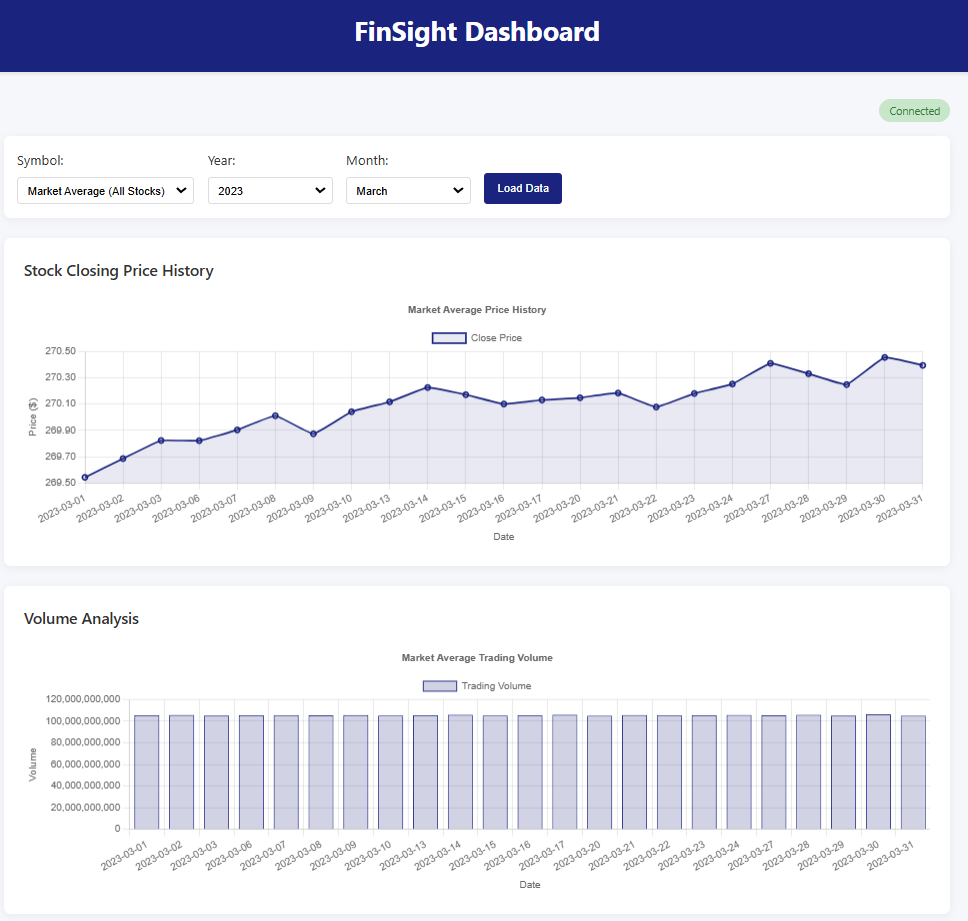
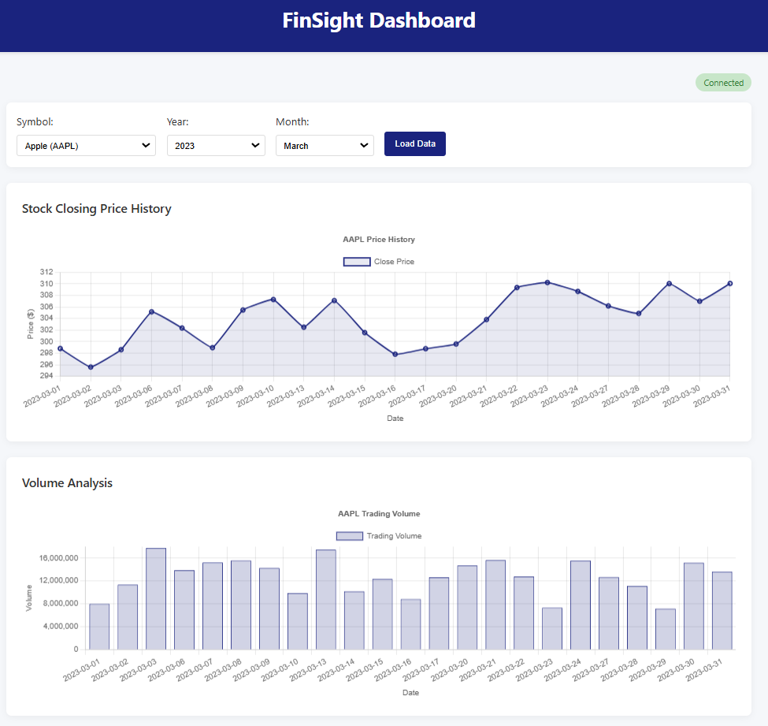

# FinSight

FinSight is an AWS serverless ETL pipeline that transforms financial data so that it can be queried quickly, especially when filtered by year and month, complete with an interactive analytics dashboard which queries the transformed data.

## How It Works

Here's a quick rundown of how FinSight operates:

- You start by uploading CSV files containing financial data to an input AWS S3 bucket.
- Once uploaded, AWS immediately sends out an event notification.
- A Lambda function receives this notification and kicks off an AWS Glue job.
- AWS Glue performs the ETL process using PySpark, converting CSV to Parquet format, creating year/month partitions, and automatically updating the schema in the Data Catalog.
- The processed data, now in an efficient Parquet format, gets stored back into S3. It’s neatly partitioned by year and month, significantly speeding up data access.
- You can then easily run SQL queries on this processed data using AWS Athena. These queries are extremely fast because they're optimized to leverage the year/month partitions.
- To make things user-friendly, there's a simple frontend dashboard connected via API Gateway which calls a Lambda function to perform the Athena queries, which allows you to visualize the results of your queries. While it's straightforward, it's designed as a fun proof of concept to demonstrate the underlying ETL pipeline and the kinds of analytics it enables.

## FinSight Demonstration

### Triggering the ETL Pipeline

_When a CSV file is uploaded to the input S3 bucket, it automatically triggers the AWS Glue ETL job through a Lambda function._

### Raw Input Data

_The raw financial data is initially stored as CSV files in the input S3 bucket, which is not optimized for analytical queries. There is 1.9GB of data in the input bucket._

### Processed Data with Partitioning

_After transformation, data is stored as Parquet files and partitioned by year and month (`/year=YYYY/month=MM/`), significantly improving query performance. Also after transformation, there is 745MB of data in the output bucket, reduced from 1.9GB._

### Query Performance Comparison

_Querying the processed data in Athena is dramatically faster than querying the raw data. Note how filtering by year/month on partitioned data executes in a second compared to three for the unprocessed data._

### Interactive Dashboard

_The web dashboard leverages the optimized data structure by executing queries that take advantage of the year/month partitioning, delivering fast insights from the financial data available in this case._

## The ETL Pipeline

### Extract

- S3 immediately alerts Lambda when a new CSV arrives in the input bucket.
- Lambda records the file details and kicks off the Glue ETL process.

### Transform

- **Format and Type Conversions**: Cleans up dates and numeric fields for consistent analytics.
- **Partitioning**: Automatically groups data by year and month for faster queries.
- **Optimized Storage**: Converts CSV files into compressed Parquet files.
- **Automatic Schema Updates**: Keeps Glue Data Catalog updated effortlessly.

### Load

- Transformed data lands in S3, neatly organized in folders like `/year=YYYY/month=MM/`.
- Athena immediately picks up on these changes, so data is ready to query instantly.

## AWS Infrastructure

### Storage & Compute

- **S3**: Handles raw CSV inputs, processed outputs, and hosts static web content.
- **Lambda**: Manages file uploads and Athena queries efficiently.
- **Glue**: Provides powerful, serverless PySpark transformations for ETL.

### Data Access

- **Athena**: Offers quick and simple SQL querying of processed data.
- **API Gateway**: Makes sure web interface communicates smoothly and securely with backend services.

## Next Steps

### Moving from Data Lake to Data Warehouse

Currently, FinSight is set up for data lake operations (S3 to Athena queries). An exciting next step would be to extend this into a fully-fledged data warehouse:

- **Redshift Integration**: Modify the Glue ETL to directly load data into Amazon Redshift.
- **Why this matters**:
  - Faster complex queries and analytics
  - Better handling of multiple users and BI tools
  - Advanced indexing to speed up analytics workflow

### Enhanced Processing

The current setup using AWS Glue is excellent for serverless operation and pretty simple PySpark transformations like have been done so far in this project. As data processing demands grow, I might explore more robust tools like EMR (Elastic MapReduce), which would offer greater flexibility, custom Spark setups, and better control for optimizing performance in more demanding analytical workloads. I also might explore even doing more complex or other transformations with AWS Glue alone while using Dynamic Frames more than Data Frames as I did for this project.
