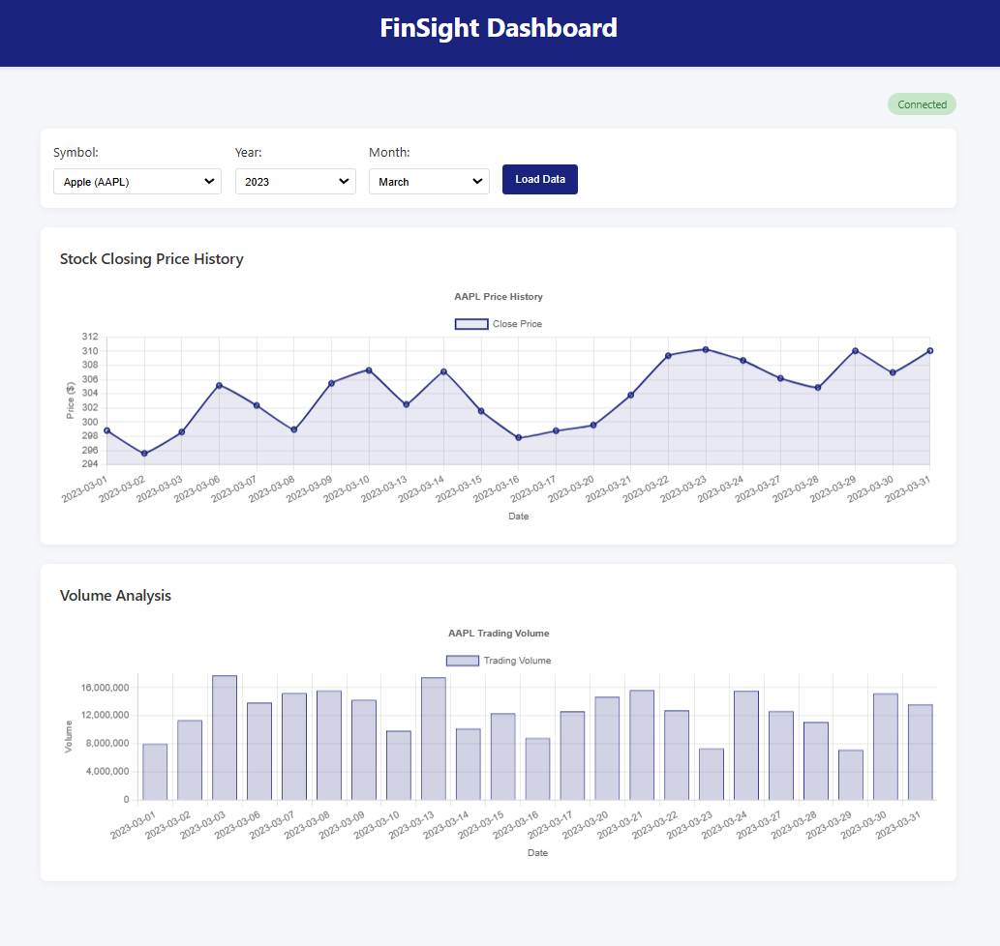

# FinSight

FinSight is a serverless ETL pipeline that simplifies financial data processing, complete with an interactive analytics dashboard, all hosted on AWS.

## How It Works

Here's a quick rundown of how FinSight operates:

- You start by uploading CSV files containing financial data to an input AWS S3 bucket.
- Once uploaded, AWS immediately sends out an event notification.
- A Lambda function receives this notification and kicks off an AWS Glue job.
- Glue uses PySpark to handle the heavy lifting, converting data formats, optimizing storage partitions, and updating the schema automatically.
- The processed data, now in an efficient Parquet format, gets stored back into S3. It’s neatly partitioned by year and month, significantly speeding up data access.
- You can then easily run SQL queries on this processed data using AWS Athena. These queries are extremely fast because they're optimized to leverage the year/month partitions.
- To make things user-friendly, there's a simple frontend dashboard connected via API Gateway which calls a Lambda function to perform the Athena queries, which allows you to visualize the results of your queries. While it's straightforward, it's designed as a fun proof of concept to demonstrate the underlying ETL pipeline and the kinds of analytics it enables.

## Watch FinSight in Action

Click above to watch the demo video above shows:

- Uploading CSVs and triggering the ETL pipeline
- Real-time data processing
- How easy it is to query data from the web dashboard
- Performance gains from input to output querying (benefit of this transformation pipeline)

## The ETL Pipeline

### Extract

- S3 immediately alerts Lambda when a new CSV arrives in the input bucket.
- Lambda records the file details and kicks off the Glue ETL process.

### Transform

- **Format and Type Conversions**: Cleans up dates and numeric fields for consistent analytics.
- **Partitioning**: Automatically groups data by year and month for faster queries.
- **Optimized Storage**: Converts CSV files into compressed Parquet files.
- **Automatic Schema Updates**: Keeps your Glue Data Catalog updated effortlessly.

### Load

- Transformed data lands in S3, neatly organized in folders like `/year=YYYY/month=MM/`.
- Athena immediately picks up on these changes, so data is ready to query instantly.

## AWS Infrastructure

### Storage & Compute

- **S3**: Handles raw CSV inputs, processed outputs, and hosts static web content.
- **Lambda**: Manages file uploads and queries efficiently.
- **Glue**: Provides powerful, serverless PySpark transformations.

### Data Access

- **Athena**: Offers quick and simple SQL querying.
- **API Gateway**: Makes sure your web interface communicates smoothly and securely with backend services.

## Next Steps

### Moving from Data Lake to Data Warehouse

Currently, FinSight is set up for data lake operations (S3 to Athena queries). An exciting next step would be to extend this into a fully-fledged data warehouse:

- **Redshift Integration**: Modify the Glue ETL to directly load data into Amazon Redshift.
- **Why this matters**:
  - Faster complex queries and analytics
  - Better handling of multiple users and BI tools
  - Advanced indexing to speed up your analytics workflow

### Enhanced Processing

The current setup using AWS Glue is excellent for serverless operation and moderately complex PySpark transformations. However, as data processing demands grow, I might explore more robust tools like EMR (Elastic MapReduce), which would offer greater flexibility, custom Spark setups, and better control for optimizing performance in more demanding analytical workloads.
