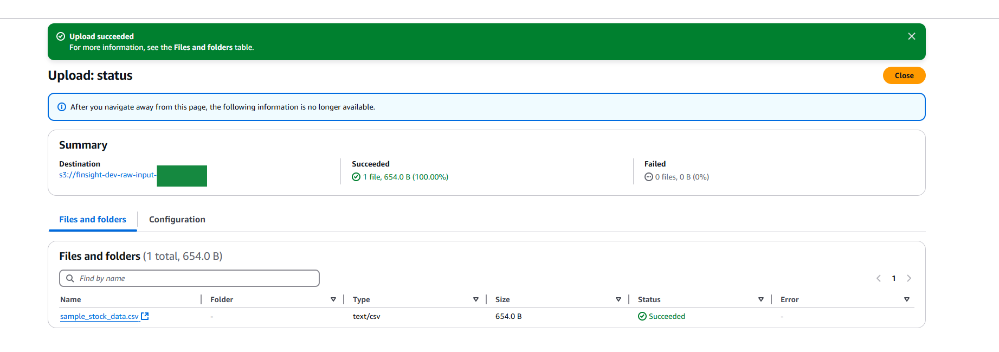
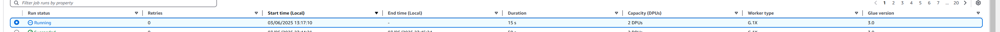
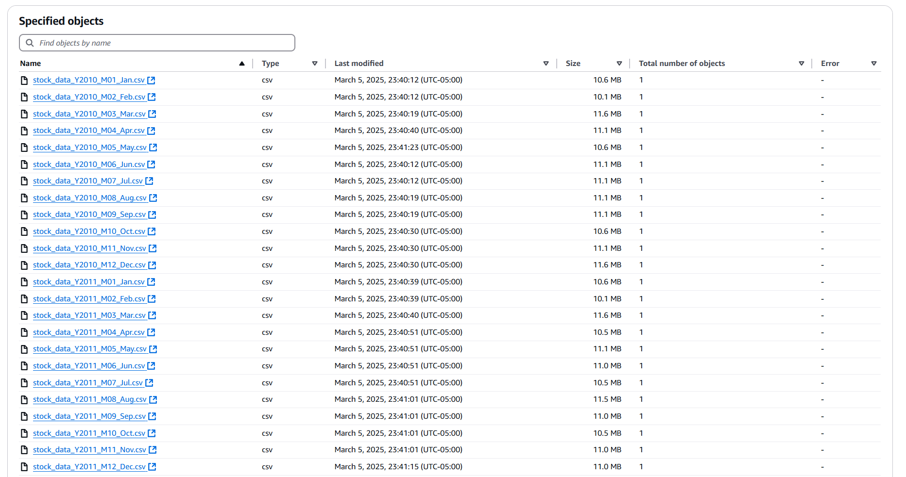
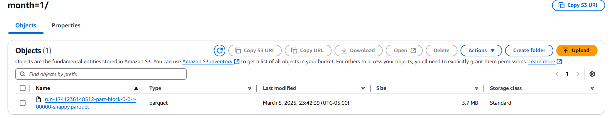
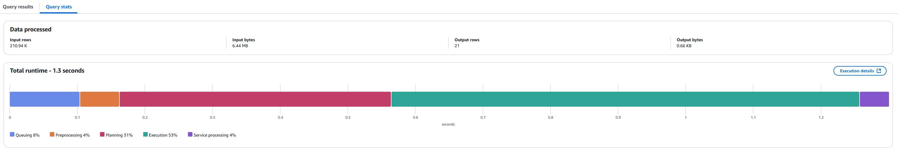

# FinSight

FinSight is an AWS serverless ETL pipeline that transforms financial data so that it can be queried quickly, especially when filtered by year and month, complete with an interactive analytics dashboard which queries the transformed data.

## How It Works

Here's a quick rundown of how FinSight operates:

- You start by uploading CSV files containing financial data to an input AWS S3 bucket.
- Once uploaded, AWS immediately sends out an event notification.
- A Lambda function receives this notification and kicks off an AWS Glue job.
- AWS Glue performs the ETL process using PySpark, converting CSV to Parquet format, creating year/month partitions, and automatically updating the schema in the Data Catalog.
- The processed data, now in an efficient Parquet format, gets stored back into S3. It's neatly partitioned by year and month, significantly speeding up data access.
- You can then easily run SQL queries on this processed data using AWS Athena. These queries are extremely fast because they're optimized to leverage the year/month partitions.
- To make things user-friendly, there's a simple frontend dashboard connected via API Gateway which calls a Lambda function to perform the Athena queries, which allows you to visualize the results of your queries. While it's straightforward, it's designed as a fun proof of concept to demonstrate the underlying ETL pipeline and the kinds of analytics it enables.

## FinSight Demonstration

### Triggering the ETL Pipeline


_Step 1: Uploading a CSV file to the input S3 bucket triggers the automated ETL process._


_Step 2: The AWS Glue ETL job is automatically triggered through a Lambda function, beginning the data transformation process._

### Raw Input Data


_The raw financial data in the input bucket takes up 1.9GB of storage space._


_The raw financial data is initially stored as CSV files in the input S3 bucket, which is not optimized querying._

Example of a CSV file:

```
date,symbol,open,high,low,close,volume
2023-01-03,AAPL,130.28,130.90,124.17,125.07,112117500
2023-01-04,AAPL,126.89,128.66,125.08,126.36,89113600
```

#### Raw Data Table Definition

The raw data is made accessible in Athena through the following table definition:

```sql
CREATE EXTERNAL TABLE IF NOT EXISTS raw_stock_data (
    date STRING,
    symbol STRING,
    open DOUBLE,
    high DOUBLE,
    low DOUBLE,
    close DOUBLE,
    volume BIGINT
)
ROW FORMAT DELIMITED
FIELDS TERMINATED BY ','
STORED AS TEXTFILE
LOCATION 's3://finsight-dev-raw-input-xxxxx/'
TBLPROPERTIES ("skip.header.line.count"="1");
```

This table definition points directly to the CSV files in the input S3 bucket, allowing Athena to query the raw data without any optimizations.

### Processed Data with Partitioning


_After transformation, the data size is reduced from 1.9GB to 745MB, demonstrating the efficiency of Parquet format._


_The transformed data is stored in the efficient Parquet format, which is columnar and compressed._


_Data is partitioned by year, allowing for efficient filtering of queries by year._


_Further partitioning by month (`/year=YYYY/month=MM/`) improves query performance by allowing Athena to scan only relevant partitions._

### Query Performance Comparison

#### Query on Raw Data

The following query runs on the raw, unoptimized CSV data:

```sql
SELECT
    date,
    AVG(close) as avg_close,
    SUM(volume) as total_volume,
    COUNT(DISTINCT symbol) as symbol_count
FROM
    raw_stock_data
WHERE
    date LIKE '2024-02%'
GROUP BY
    date
ORDER BY
    date;
```


_Querying the raw data requires Athena to scan the entire dataset, even though we're only interested in February 2024 data. This results in slower performance and higher costs. You can see this as the input rows in the image are 39.31M and 85% of the total runtime is spent in execution._

#### Query on Processed Data

The same query on the processed, partitioned Parquet data:

```sql
SELECT
    date,
    AVG(close) as avg_close,
    SUM(volume) as total_volume,
    COUNT(DISTINCT symbol) as symbol_count
FROM
    stock_data
WHERE
    year = 2024 AND
    month = 2
GROUP BY
    date
ORDER BY
    date;
```


_Querying the processed data is significantly faster because Athena only needs to scan the relevant partition (year=2024, month=2) rather than the entire dataset.You can see this as the input rows are now 210K rather than 39.31M and the execution time is only 53% while more time is spent planning now. The total runtime for the query dropped from 1.9 to 1.3 seconds and this differnece in performance should only grow as we store more data._

### Interactive Dashboard


_The web dashboard provides an overview of stock performance across all companies, leveraging the optimized data structure._


_Detailed view of Apple stock performance. The dashboard executes queries that take advantage of the year/month partitioning, delivering fast insights from the financial data._

## The ETL Pipeline

### Extract

- S3 immediately alerts Lambda when a new CSV arrives in the input bucket.
- Lambda records the file details and kicks off the Glue ETL process.

### Transform

- **Format and Type Conversions**: Cleans up dates and numeric fields for consistent analytics.
- **Partitioning**: Automatically groups data by year and month for faster queries.
- **Optimized Storage**: Converts CSV files into compressed Parquet files.
- **Automatic Schema Updates**: Keeps Glue Data Catalog updated effortlessly.

### Load

- Transformed data lands in S3, neatly organized in folders like `/year=YYYY/month=MM/`.
- Athena immediately picks up on these changes, so data is ready to query instantly.

## AWS Infrastructure

- **S3**: Handles raw CSV inputs, processed outputs, and hosts static web content.
- **Lambda**: Manages file uploads and Athena queries.
- **Glue**: Serverless ETL.
- **Athena**: Offers simple SQL querying of processed and unprocessed data in S3.
- **API Gateway**: Makes sure web interface communicates smoothly and securely with backend services.

## Next Steps

### Data Warehouse Integration

The current implementation successfully demonstrates a data lake architecture with S3 and Athena where we go from S3 to S3. A logical next step would be to integrate with Amazon Redshift to:

- Support more complex analytical queries that benefit from Redshift's columnar storage and distributed query execution
- Enable more concurrent users as the dashboard usage grows

### Enhanced ETL Processing

Building on the current Glue ETL job, future enhancements could include:

- Migrating to Amazon EMR (Elastic MapReduce) for more complex transformations that require fine-tuned control over the Spark environment
- Implementing more sophisticated transformations in general as well as using AWS Glue Dynamic Frames
- Creating additional partitioning schemes based on actual query patterns
